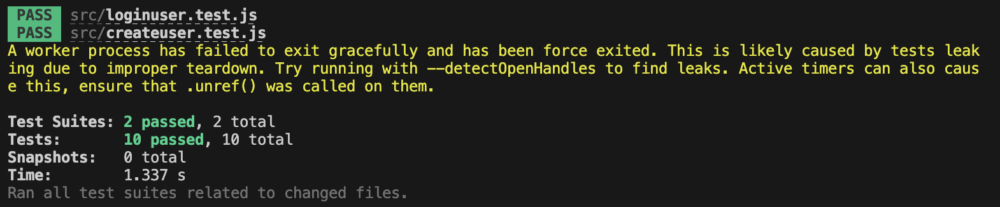

# COMP333_HW3
Frontend (JavaScript, React, MVC, REST APIs) + Backend Merging

Sydney Keller (<smkeller@wesleyan.edu>)
Minji Woo (<mwoo@wesleyan.edu>)


# Purpose:
Learning how to:</br>
(1) design and implement a single page app (SPA) with a JavaScript/React frontend, and</br>
(2) use the Model-view-controller (MVC) design pattern to create a representational state transfer (REST) API to connect your frontend to the PHP/MySQL backend of your app.</br>
(3) gain experience with build tools, package managers, and the integration of third party code, which is a critical skill, in particular, in open source work.


# Setting up the developement environment:
1. GIT clone directly into XAMPP htdocs folder
2. Copy the 'frontend' folder which contains the entire react app from htdocs/COMP333_HW3 and paste it into your desktop which may take a minute. You can now delete your 'frontend' folder from your COMP333_HW3 repo because a copy of it lives on your desktop. (Note: Please do not move the frontend folder by dragging it. This will not work. Make sure you copy the folder and then paste it in desktop.)
3. Make sure your general structure of files is as follows:
- XAMPP/xamppfiles/htdocs/COMP333_HW3 (the repo)
- COMP333_HW3 should only contain License, Readme, index.php and Controller, inc, Images, Model folders once frontend is moved to desktop
4. Setting up MySQL database, local XAMPP dev environment, and phpMyAdmin:
- Screenshot of local XAMPP developement environment 
</br>

- Screenshot of user table structure
</br>

- Screenshot of an example of user table data
</br>

- Screenshot of ratings table structure
</br>

- Screenshot of an example of ratings table data
</br>
5. Through XAMPP, make sure MySQL Database and Apache Web Server are running</br>
 <!-- break -->
Note: assuming you have homebrew and node.js installed
 <!-- break -->
6. cd into your frontend folder on desktop (or wherever you put it) which holds the react app and run 'npm start'
7. In your browser at http://localhost:3000 you should now the react app running and see the login form


# How to run the code:
Locally in a browser using XAMPP localhost URL (need to have the proper mySQL databases set up)</br>
You also need to have your react-app front end folder running (discussed in the "Setting up developement environment" section - run 'npm start' in frontend folder)</br>

The URL you will be taken to after running 'npm start': http://localhost:3000

# How to test frontend using Jest
1. Set up your XAMPP for your backend (run Apache - port 80 and MySQL - port 3306)
2. GIT clone the repository:
3. CD into the repo and then the frontend folder
```
cd COMP333_HW3/frontend
``` 
4. Setup Jest to install dependencies:
```
npm install --save-dev @testing-library/jest-dom
npm install -—save-dev jest @testing-library/react @testing-library/jest-dom
```
5. Run the development server:
```
npm test
```
You will see the following result:
</br>

# Folders and Files:
## Rest API/Model, View, Controller Architecture:
index.php: the entry-point of our application, front-controller of application. index.php connects to UserController.php for all interactions with database</br>
inc:
 - config.php: holds the configuration information of application, holds the database credentials. 
 - bootstrap.php: used to bootstrap  application by including the necessary files
 <!-- end of the list -->
Model:
- Database.php: the database access layer which will be used to interact with the underlying MySQL database.
- UserModel.php: the User model file which implements the necessary methods to interact with the users table in the MySQL database.
<!-- end of the list -->
Controller/Api:
- BaseController.php: a base controller file which holds common utility methods.
- UserController.php: the User controller file which holds the necessary application code to entertain REST API calls. Creates a user, logs a user in, gets data from ratings table for user, deletes, adds, and updates ratings for user.
<!-- end of the list -->
Checkout this tutorial for how more details on how we set up our REST API:
https://code.tutsplus.com/how-to-build-a-simple-rest-api-in-php--cms-37000t

## Frontend React App:
frontend (again, this folder should be moved out of htdocs folder to somewhere else (eg desktop)):
- package-lock.json: automatically generated for any operations where npm modifies either the node_modules tree, or package. json
- package.json: used to store the metadata associated with project as well as store the list of dependency packages
- node_models: folder that comes with react app, holds node modules
- public: folder that holds react app logos and index.html
    - index.html: where the whole JSX code goes, entry point of application
- src: folder that holds the following files:
    - App.css: App.js style sheet
    - App.js: main component
    - index.css: index.js style sheet
    - index.js: file to render App.js to main root
    - App.test.js: react app testing file for App.js (comes with react app)
    - reportWebVitals: gives metrics of react app user performance (comes with react app)
    - setupTests.js - file to include test configuration (comes with react app)
    - createuser.js - component that connects with backend to create a new user and log them in
    - loginuser.js - component that connects with backend to log user in
    - ratingstable.js - component that displays all ratings data in ratings datatable. Also implements search/filter functionality taken from searchfilterratings.js component and deals with updates/deletes and user checks.
    - deleterating.js - component that connects with backend to delete a given rating selected by user on frontend
    - addnewrating.js - component that connects with backend to add a new rating to the datatable
    - updaterating.js - component that connects with backend to update a given rating selected by user on frontend
    - viewrating.js - component that lets a user view a single rating
    - searchfilerratings.js - component for search and filtering ratings datatable
    - Ratings.css - ratingstable.js style sheet

## Other files:
Images:
- Sydney_XAMPP - Screenshot of local XAMPP developement environment
- Sydney_user_table_structure.png - Screenshot of user_table structure from phpMyAdmin
- Sydney_user_table.png - Screenshot of user_table from phpMyAdmin
- Sydney_ratings_table_structure.png - Screenshot of ratings_table structure from phpMyAdmin
- Sydney_ratings_table.png - Screenshot of ratings_table from phpMyAdmin


# Sources Cites:
https://code.tutsplus.com/how-to-build-a-simple-rest-api-in-php--cms-37000t - Source given in class to create base of REST API</br>
https://www.reddit.com/r/react/comments/13srit3/having_trouble_adding_proxy_to_packagejson_to/ - workaround for having trouble adding proxy to package.json to connect frontend to backend</br>
https://stackoverflow.com/questions/63124161/attempted-import-error-switch-is-not-exported-from-react-router-dom - Getting error, needed to change Switch to Routes and change Route syntax</br>
https://www.php.net/manual/en/function.password-hash.php - Understand password_hash()</br>
https://www.w3schools.com/php/func_mysqli_fetch_all.asp - Understand fetch_all(MYSQLI_ASSOC) function in the REST API</br>
https://stackoverflow.com/questions/21267064/mysql-database-wont-start-in-xampp-manager-osx - MySQL Database won’t start in XAMPP fix</br>
https://www.reddit.com/r/PHP/comments/2cjoqp/where_do_you_recommend_to_store_session_keys_for/ - Understanding PHP sessions in REST API (not a thing)</br>
https://www.php.net/manual/en/mysqli-stmt.store-result.php - mysql store_result()</br>
https://www.w3schools.com/php/php_superglobals_globals.asp - How to use global functions in classes</br>
https://stackoverflow.com/questions/6490482/are-there-dictionaries-in-php - Arrays in PHP</br>
https://www.tutorialspoint.com/postman/postman_post_requests.htm - Postman</br>
https://stackoverflow.com/questions/37492271/should-i-handle-html-form-validation-on-front-or-backend#:~:text=You%20should%20always%20check%20the,way%20to%20have%20sane%20data - Understanding backend vs frontend</br>
https://vsupalov.com/how-backend-and-frontend-communicate/ - Understanding backend vs frontend</br>
https://stackoverflow.com/questions/67506517/inserting-data-into-database-on-postman - Understanding Postman</br>
https://stackoverflow.com/questions/48877079/getting-post-request-message-using-react-js - Trying to communicate with backend</br>
https://www.makeuseof.com/redirect-user-after-login-react/#:~:text=To%20redirect%20the%20user%2C%20you,from%20react%2Drouter%2Ddom. - How to Redirect a User After Login in React</br>
https://stackoverflow.com/questions/60923858/react-js-get-error-message-despite-http-response-400 - figuring out how to show HTTP description error to frontend</br>
https://www.techomoro.com/submit-a-form-data-to-rest-api-in-a-react-app/ - Submit Form Data To REST API In A React App</br>
https://stackoverflow.com/questions/8719276/cross-origin-request-headerscors-with-php-headers - Figuring out CORS headers</br>
https://stackoverflow.com/questions/51504231/php-api-rest-does-not-accept-cors-requests-even-using-header-access-control-al - CORS headers</br>
https://jasonwatmore.com/post/2020/02/01/react-fetch-http-post-request-examples - React fetch POST requests</br>
https://www.youtube.com/watch?v=qdCHEUaFhBk&list=PL4cUxeGkcC9gZD-Tvwfod2gaISzfRiP9d&index=17 - fetching data in react</br>
https://react.dev/learn - react documentation</br>
https://timmousk.com/blog/git-push-hangs/ - Uploading react app files were too big</br>
https://stackoverflow.com/questions/35191336/how-to-map-a-dictionary-in-reactjs - How to map a dictionary in reactJS</br>
https://www.geeksforgeeks.org/how-to-get-parameters-from-a-url-string-in-php/ - how to use/create URI arguments</br>
https://stackoverflow.com/questions/5884807/get-url-parameter-in-php - how to receive URI arguments from frontend</br>
https://stackoverflow.com/questions/61517408/how-i-can-use-php-session-in-react - integrating PHP sessions to react</br>
https://stackoverflow.com/questions/676846/do-ajax-requests-retain-php-session-info - integrating PHP sessions to react</br>
https://developer.mozilla.org/en-US/docs/Web/API/Storage/setItem - store username locally</br>
https://www.freecodecamp.org/news/search-and-filter-component-in-reactjs/ - search feature</br>
https://www.w3schools.com/REACT/react_forms.asp - understanding forms for submission</br>
https://www.w3schools.com/REACT/react_usestate.asp - useState hook for frontend</br>
https://www.w3schools.com/REACT/react_useeffect.asp - useEffect use in working with / updating</br> data
https://www.w3schools.com/REACT/react_props.asp - props</br>
https://www.w3schools.com/REACT/react_events.asp - events</br>
